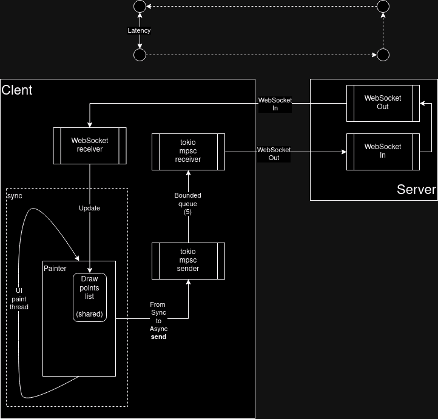
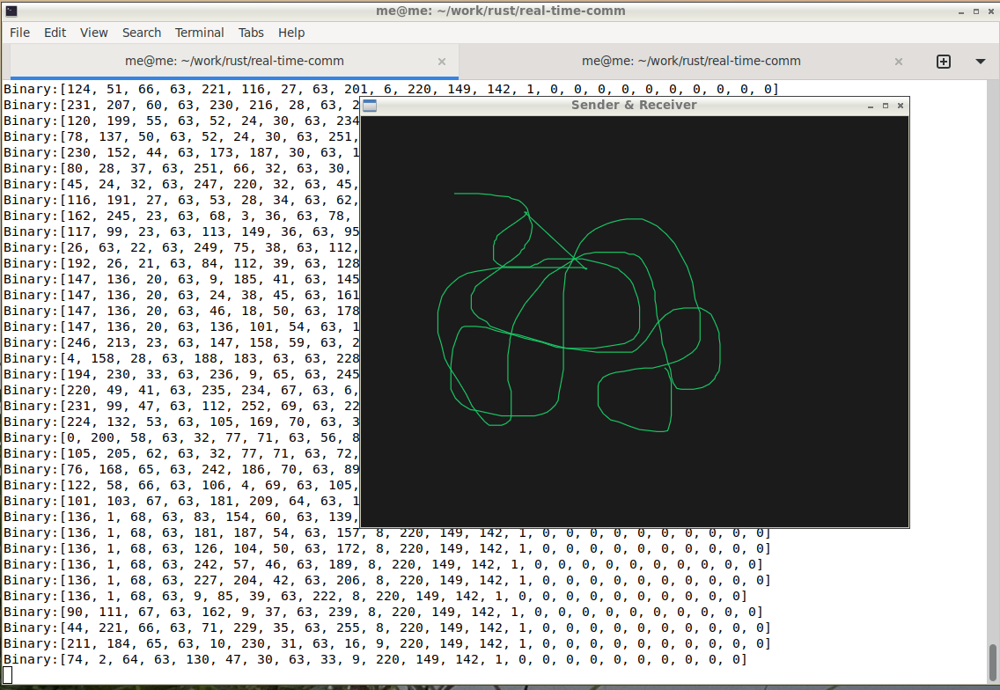

# WebSocket comm latency test
Visualization of WebSocket communication latency. 

## About
I always wanted to implement the kind of server/client application that would visualize latency of client/server communication. The `draw` kind of client, where mouse action would initiate data transfer, would visually display delay - mouse pointer location vs available draw points.
This app is not perfect. Ideally, arriving data points shuld trigger canvas `paint` functionality (something to improve, amng other things)

## Technologies showcase
- UI [egui](https://crates.io/crates/egui)
- Web framework [axum](https://crates.io/crates/axum)
- Axum WebSockets [ws](https://docs.rs/axum/latest/axum/extract/ws/index.html)
- Sync and Async integration
- Channels [bounded mpsc channel](https://docs.rs/tokio/latest/tokio/sync/mpsc/fn.channel.html)
- Tokio [RwLock](https://docs.rs/tokio/latest/tokio/sync/struct.RwLock.html) for shared object (Sync+Async)


## Architecture




## Prerequisites
- Rust (latest stable) – [How to install Rust](https://www.rust-lang.org/en-US/install.html)
- your OS [egui prerequisites](https://crates.io/crates/egui)
for Debian base Linux distros (`libssl-dev` is not used directly in this repo) 
```
sudo apt-get install -y libclang-dev libgtk-3-dev libxcb-render0-dev libxcb-shape0-dev libxcb-xfixes0-dev libxkbcommon-dev libssl-dev
```
- Get the code 
```
$ git clone git@github.com:soleinik/real-time-comm.git && cd real-time-comm
```
- Build 
```
$ cargo build
```


## How to run
1. Run server first
```
$ cargo run --bin server

Finished dev [unoptimized + debuginfo] target(s) in 0.08s
     Running `target/debug/server`
listening on 127.0.0.1:8080
```

2. Run client 

In separate terminal
```
$ cargo run --bin client


Finished dev [unoptimized + debuginfo] target(s) in 0.12s
Running `target/debug/client`

Server response was Response { status: 101, version: HTTP/1.1, headers: {"connection": "upgrade", "upgrade": "websocket", "sec-websocket-accept": "gH7VWY6gYJpIK/7e/FPdAZzbjnk=", "date": "Sun, 31 Mar 2024 18:50:32 GMT"}, body: None }
WS::ping - [1, 2, 3]
```
In server side terminal communication traces should be available
```
listening on 127.0.0.1:8080
2024-03-31T18:50:09.512803Z DEBUG request{method=GET uri=/ws version=HTTP/1.1 headers={"host": "127.0.0.1:8080", "connection": "Upgrade", "upgrade": "websocket", "sec-websocket-version": "13", "sec-websocket-key": "m87W4ZbmMAcE3g2IFuuSww=="}}: tower_http::trace::on_request: started processing request
2024-03-31T18:50:09.512895Z DEBUG request{method=GET uri=/ws version=HTTP/1.1 headers={"host": "127.0.0.1:8080", "connection": "Upgrade", "upgrade": "websocket", "sec-websocket-version": "13", "sec-websocket-key": "m87W4ZbmMAcE3g2IFuuSww=="}}: tower_http::trace::on_response: finished processing request latency=0 ms status=101
Pinged 127.0.0.1:34342...
Pong:[1, 2, 3]
```

A window should pop up. Draw on it with a mouse... 



3. Observe delay (if any)


## TODOs
- error handling (reconnects/retries)

## Conclusion
Running Server & Client on my host, with WebSockets being bydirectional TCP, I did not see any delay. 

However, the [Payload](./client/src/comm/payload.rs#L11) contains timestamp that can be used to programmatically measure delay (and, probably, display it in the window itself (this is not done)).

Another (interesting) exersise, would be to try [WebRTC](https://crates.io/crates/webrtc) as comm protocol (just for kicks and diff teck stack comparisons) 


